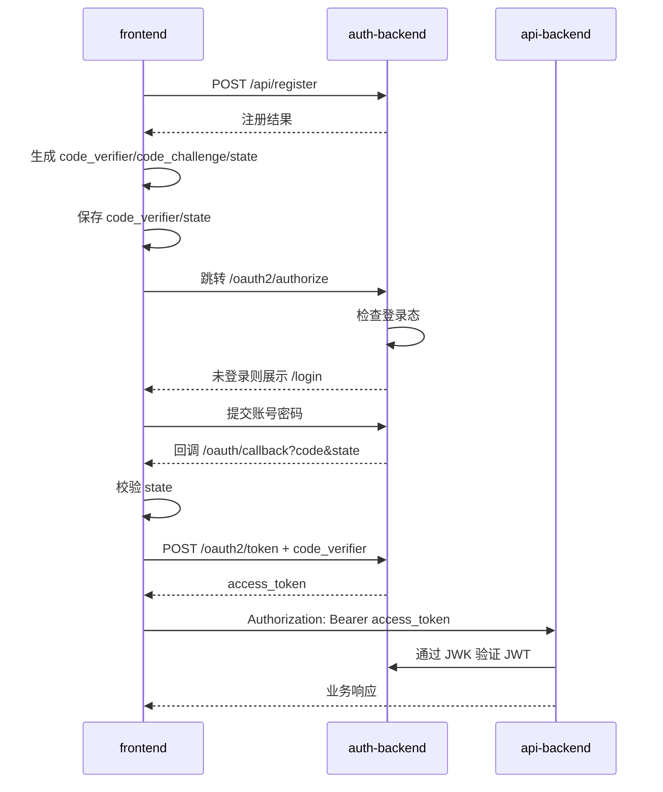

# Mini-Tiktok 登录注册流程说明

## 1. 参与模块

```text
frontend:     http://localhost:5173
auth-backend: http://localhost:9000
api-backend:  http://localhost:8085
```

- `frontend`：负责 SPA 注册表单、生成 PKCE 参数、保存临时登录状态、处理 OAuth2 回调和保存 access token。
- `auth-backend`：负责用户注册登录、OAuth2 授权、签发 JWT access token、暴露 JWK 公钥。
- `api-backend`：只作为 Resource Server 校验 Bearer JWT，不参与登录注册中转。

边界：

- 用户账号、密码和 token 签发都归 `auth-backend`。
- `frontend` 直接调用 `auth-backend` 注册和换 token。
- `api-backend` 不保存密码，不签发 token，不生成 PKCE 参数，不代理注册。
- 业务数据中的 `uploader_id` 使用 JWT `sub`。

## 2. 注册流程

```text
1. 用户在 frontend 的 /register 输入 username/password
2. frontend 调用:
   POST http://localhost:9000/api/register
3. auth-backend 校验用户名和密码
4. auth-backend 使用 BCrypt 保存 password_hash
5. auth-backend 返回用户基础信息
6. frontend 提示注册成功，用户再发起 OAuth2 登录
```

请求示例：

```http
POST /api/register HTTP/1.1
Host: localhost:9000
Content-Type: application/json

{
  "username": "demo2",
  "password": "Demo@123456"
}
```

成功响应示例：

```json
{
  "code": 200,
  "message": "success",
  "data": {
    "id": 2,
    "username": "demo2"
  }
}
```

异常情况：

- 用户名长度不合法或密码过短：返回 `400`。
- 用户名重复：返回 `409`。
- `auth-backend` 不可用：前端展示注册失败。

## 3. 登录流程

登录使用 OAuth2 Authorization Code + PKCE。

```text
1. 用户点击 frontend 登录按钮
2. frontend 生成:
   code_verifier
   code_challenge = BASE64URL(SHA256(code_verifier))
   state
3. frontend 将 code_verifier 和 state 保存到 sessionStorage
4. frontend 跳转 auth-backend:
   GET http://localhost:9000/oauth2/authorize
5. auth-backend 检查用户是否已登录
6. 未登录时展示 auth-backend 的 /login 页面
7. 用户提交账号密码
8. auth-backend 登录成功后生成 authorization code
9. 浏览器回跳 frontend:
   http://localhost:5173/oauth/callback?code=xxx&state=xxx
```

授权 URL 示例：

```text
http://localhost:9000/oauth2/authorize
  ?response_type=code
  &client_id=tiktok-web
  &redirect_uri=http%3A%2F%2Flocalhost%3A5173%2Foauth%2Fcallback
  &scope=video%3Aread%20video%3Awrite%20video%3Alike
  &state=...
  &code_challenge=...
  &code_challenge_method=S256
```

## 4. 回调换 Token

```text
1. frontend 进入 /oauth/callback
2. frontend 校验 URL 中的 state 是否等于 sessionStorage 中保存的 state
3. frontend 读取 sessionStorage 中的 code_verifier
4. frontend 调用 auth-backend:
   POST http://localhost:9000/oauth2/token
5. auth-backend 校验 authorization code、redirect_uri 和 PKCE code_verifier
6. auth-backend 签发 JWT access token
7. frontend 保存 access_token
8. frontend 清理 sessionStorage 中的 code_verifier 和 state
9. frontend 调用 api-backend 的 /api/me 获取当前用户
```

换 token 请求示例：

```http
POST /oauth2/token HTTP/1.1
Host: localhost:9000
Content-Type: application/x-www-form-urlencoded

grant_type=authorization_code&
client_id=tiktok-web&
redirect_uri=http://localhost:5173/oauth/callback&
code=xxx&
code_verifier=xxx
```

JWT access token 至少包含：

```json
{
  "iss": "http://localhost:9000",
  "sub": "1",
  "preferred_username": "demo",
  "scope": "video:read video:write video:like",
  "exp": 1710000000,
  "iat": 1709992800
}
```

## 5. 访问业务接口

登录成功后，frontend 调用 `api-backend` 业务接口时携带 Bearer token：

```http
GET /api/me HTTP/1.1
Host: localhost:8085
Authorization: Bearer <access_token>
```

`api-backend` 的处理逻辑：

```text
1. 从 Authorization header 读取 Bearer token
2. 根据 issuer-uri 发现 auth-backend 元数据
3. 通过 /oauth2/jwks 获取 JWK 公钥
4. 校验 JWT 签名、issuer、过期时间
5. 从 JWT 读取 sub、preferred_username、scope
6. 将 scope 转成 SCOPE_video:read 等 Spring Security 权限
7. 业务接口使用 sub 作为当前用户 ID
```

`GET /api/me` 成功响应示例：

```json
{
  "code": 200,
  "message": "success",
  "data": {
    "userId": "1",
    "username": "demo",
    "scopes": ["video:read", "video:write", "video:like"]
  }
}
```

## 6. 权限和失败场景

- 无 token 访问受保护接口：`401 Unauthorized`。
- token 过期或签名错误：`401 Unauthorized`。
- scope 不足：`403 Forbidden`。
- `redirect_uri` 与 client 注册值不一致：授权失败。
- `state` 与 sessionStorage 中保存的值不一致：前端拒绝换 token。
- `code_verifier` 与 `code_challenge` 不匹配：换 token 失败。
- authorization code 重复使用：换 token 失败。

## 7. 流程图


