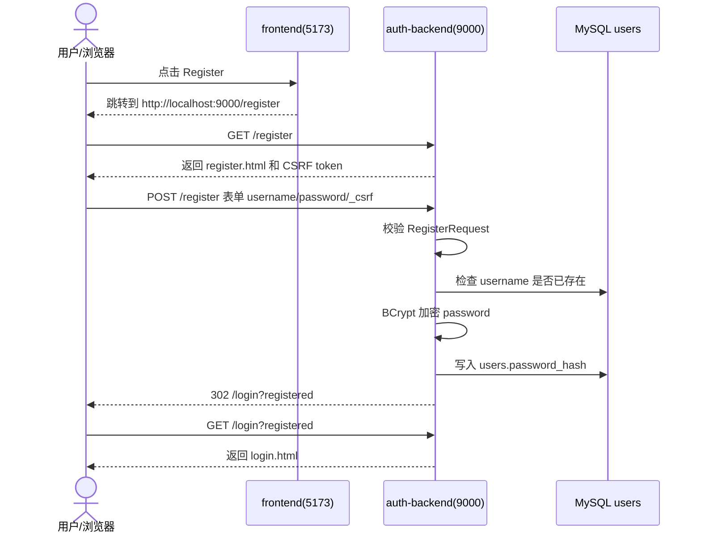
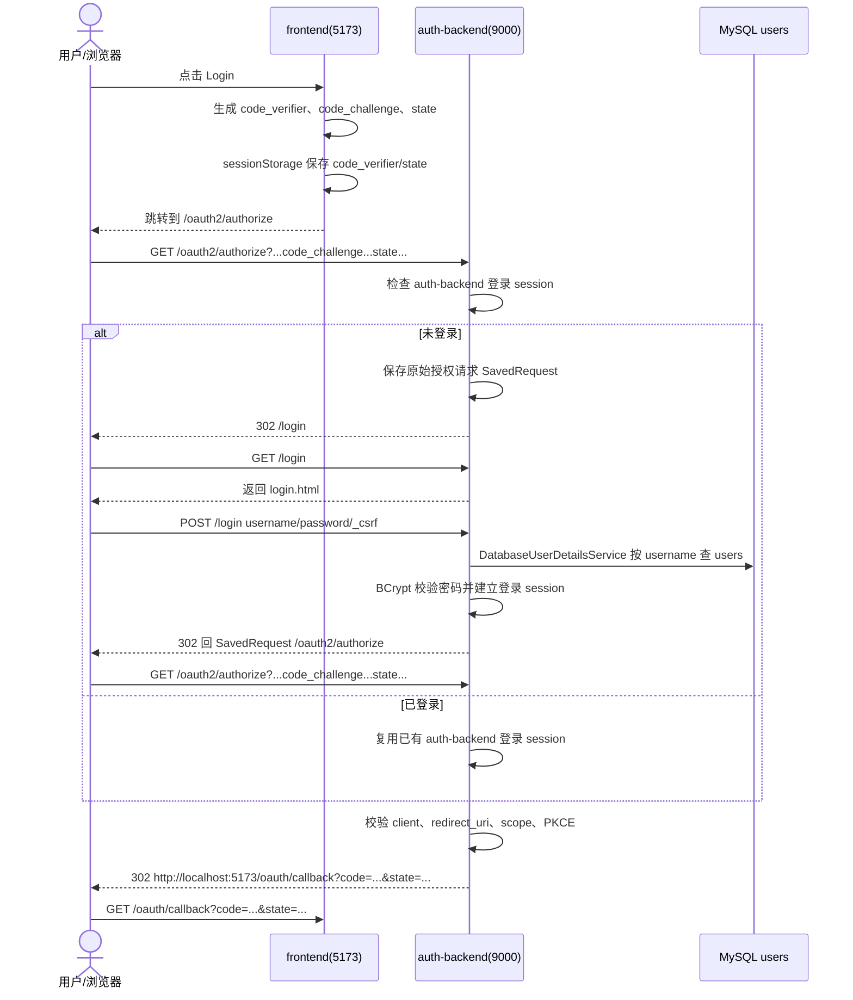
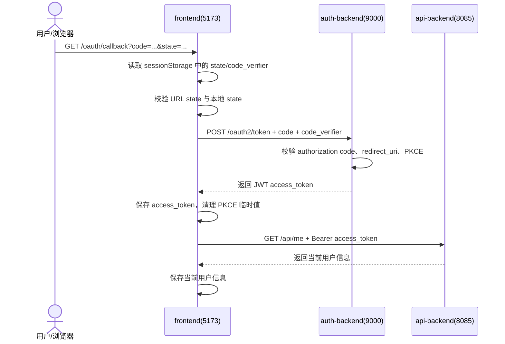

# Mini-Tiktok 登录注册流程说明

本文档按当前项目代码描述登录、注册、换 token、访问业务接口的真实链路。

## 1. 参与模块

```text
frontend:     http://localhost:5173
auth-backend: http://localhost:9000
api-backend:  http://localhost:8085
```

- `frontend`：提供登录/注册入口，生成 OAuth2 PKCE 参数，保存 `code_verifier` 和 `state`，处理 `/oauth/callback`，保存 access token 和当前用户信息。
- `auth-backend`：托管登录页和注册页，处理用户表单注册、Spring Security 表单登录、OAuth2 Authorization Code + PKCE、JWT access token 签发和 JWK 暴露。
- `api-backend`：作为 Resource Server 校验 Bearer JWT，提供 `/api/me` 和业务接口，不参与登录注册中转。

边界：

- 用户账号、密码和 token 签发都归 `auth-backend`。
- 注册页面、登录页面和 token 签发都由 `auth-backend` 负责。
- `api-backend` 不保存密码，不签发 token，不生成 PKCE 参数，不代理注册。
- 业务数据中的 `uploader_id` 使用 JWT `sub`。

## 2. 注册流程

当前注册采用 `auth-backend` 托管页面：`frontend` 只负责把浏览器带到注册页，真正的 HTML 页面和表单提交都在 `auth-backend`。



步骤：

1. 用户在 `frontend` 点击注册入口。
2. `frontend` 使用 `buildRegisterUrl()` 跳转到 `http://localhost:9000/register`。
3. `auth-backend` 的 `AuthPageController#get /register` 返回 `register.html`。
4. 用户输入 `username/password` 后提交表单到 `POST /register`。
5. `AuthPageController#post /register` 调用 `UserService.register`。
6. `UserService` 校验用户名唯一性，并用 `BCryptPasswordEncoder` 保存 `password_hash`。
7. 注册成功后重定向到 `http://localhost:9000/login?registered`。

请求示例：

```http
POST /register HTTP/1.1
Host: localhost:9000
Content-Type: application/x-www-form-urlencoded

username=demo2&password=Demo@123456&_csrf=...
```

异常情况：

- 用户名或密码格式不合法：`auth-backend` 重新渲染注册页并展示字段错误。
- 用户名重复：`auth-backend` 重新渲染注册页并展示错误。
- CSRF token 缺失或错误：表单提交被 Spring Security 拒绝。
- `auth-backend` 不可用：浏览器无法打开注册页。

说明：当前最终链路没有 `POST /api/register`。SPA 不直接提交 JSON 注册请求，注册主流程是浏览器访问 `auth-backend` 的 HTML 表单页面。

## 3. 登录流程

登录使用 OAuth2 Authorization Code + PKCE。PKCE 参数由 `frontend` 生成并保存，`api-backend` 不参与登录 URL 生成。



步骤：

1. 用户点击 `frontend` 登录按钮。
2. `frontend/src/utils/pkce.ts` 生成 `code_verifier`。
3. `frontend` 用 Web Crypto API 计算 `code_challenge = BASE64URL(SHA256(code_verifier))`。
4. `frontend` 生成随机 `state`。
5. `frontend/src/utils/token.ts` 将 `code_verifier/state` 保存到 `sessionStorage`。
6. `frontend/src/api/auth.ts` 构造授权 URL，并跳转到 `auth-backend /oauth2/authorize`。
7. `auth-backend` 检查当前浏览器是否已有 `auth-backend` 登录 session。
8. 未登录时，`SecurityConfig` 保存原授权请求并重定向到 `/login`。
9. `GET /login` 由 `AuthPageController` 返回 `login.html`。
10. 用户提交 `POST /login`。
11. `POST /login` 由 Spring Security `formLogin()` 的 filter 处理，不是业务 Controller 方法。
12. `DatabaseUserDetailsService` 从 `users` 表按用户名查用户，Spring Security 使用 BCrypt 校验密码。
13. 登录成功后回到原始 `/oauth2/authorize` 请求。
14. `auth-backend` 生成 authorization code，并重定向回 `frontend /oauth/callback`。

授权 URL 示例：

```text
http://localhost:9000/oauth2/authorize
  ?response_type=code
  &client_id=tiktok-web
  &redirect_uri=http%3A%2F%2Flocalhost%3A5173%2Foauth%2Fcallback
  &scope=video%3Aread%20video%3Awrite%20video%3Alike
  &state=...
  &code_challenge=...
  &code_challenge_method=S256
```

说明：

- `auth-backend` 响应 `GET /login` 返回 HTML 登录页。
- `POST /login` 由 Spring Security 的 `UsernamePasswordAuthenticationFilter` 接管。
- 直接打开 `http://localhost:9000/login` 登录时，如果没有 OAuth2 SavedRequest，登录成功后回到 `http://localhost:5173`。
- OAuth2 回调错误页是前端安全保护：当没有 `code_verifier/state` 或 state 不匹配时，前端拒绝换 token。

## 4. 回调换 Token



步骤：

1. `frontend` 进入 `/oauth/callback`。
2. `frontend` 校验 URL 中的 `state` 是否等于 `sessionStorage` 中保存的 `state`。
3. `frontend` 读取 `sessionStorage` 中的 `code_verifier`。
4. `frontend` 调用 `auth-backend` 的 `POST /oauth2/token`。
5. `auth-backend` 校验 authorization code、redirect_uri 和 PKCE `code_verifier`。
6. `auth-backend` 签发 JWT access token。
7. `frontend` 保存 `access_token`。
8. `frontend` 清理 `sessionStorage` 中的 `code_verifier/state`。
9. `frontend` 立即调用 `api-backend` 的 `GET /api/me` 获取并保存当前用户信息。

换 token 请求示例：

```http
POST /oauth2/token HTTP/1.1
Host: localhost:9000
Content-Type: application/x-www-form-urlencoded

grant_type=authorization_code&
client_id=tiktok-web&
redirect_uri=http://localhost:5173/oauth/callback&
code=xxx&
code_verifier=xxx
```

JWT access token 至少包含：

```json
{
  "iss": "http://localhost:9000",
  "sub": "1",
  "preferred_username": "demo",
  "scope": "video:read video:write video:like",
  "exp": 1710000000,
  "iat": 1709992800
}
```

## 5. 访问业务接口

登录成功后，`frontend` 调用 `api-backend` 业务接口时携带 Bearer token：

```http
GET /api/me HTTP/1.1
Host: localhost:8085
Authorization: Bearer <access_token>
```

`api-backend` 的处理逻辑：

```text
1. 从 Authorization header 读取 Bearer token
2. 根据 spring.security.oauth2.resourceserver.jwt.jwk-set-uri 请求 auth-backend /oauth2/jwks
3. 校验 JWT 签名、issuer、过期时间
4. 从 JWT 读取 sub、preferred_username、scope
5. 将 scope 转成 SCOPE_video:read 等 Spring Security 权限
6. 业务接口使用 sub 作为当前用户 ID
```

`GET /api/me` 成功响应示例：

```json
{
  "code": 200,
  "message": "success",
  "data": {
    "userId": "1",
    "username": "demo",
    "scopes": ["video:read", "video:write", "video:like"]
  }
}
```

## 6. 退出流程

```text
1. 用户点击 frontend 退出
2. frontend 清理 sessionStorage 中的 access_token、user、PKCE 临时值
3. 浏览器跳转到 http://localhost:9000/logout
4. auth-backend 清理 Spring Security authentication
5. auth-backend invalidate HttpSession，并删除 JSESSIONID
6. auth-backend 重定向回 http://localhost:5173
```

说明：退出必须经过 `auth-backend /logout`。如果只清理前端 token，不清理 `auth-backend` 的 `JSESSIONID`，下一次点击登录可能会复用旧 session 并直接完成授权。

## 7. 权限和失败场景

- 无 token 访问受保护接口：`401 Unauthorized`。
- token 过期或签名错误：`401 Unauthorized`。
- scope 不足：`403 Forbidden`。
- `redirect_uri` 与 client 注册值不一致：授权失败。
- `state` 与 `sessionStorage` 中保存的值不一致：前端拒绝换 token。
- `code_verifier` 与 `code_challenge` 不匹配：换 token 失败。
- authorization code 重复使用：换 token 失败。
- 直接打开 `/oauth/callback?code=...&state=...`，但本地没有 PKCE 临时值：前端拒绝换 token，并提示重新登录。

## 8. Review 覆盖点

- 浏览器访问 `GET /register` 获取 auth-backend HTML 页面，再提交 `POST /register` 表单。
- 浏览器访问 `GET /login` 获取 auth-backend HTML 页面。
- `POST /login` 由 Spring Security filter 处理，调用 `DatabaseUserDetailsService` 从 `users` 表查找用户并用 BCrypt 校验密码。
- `demo / Demo@123456` 可用于登录验证。
- PKCE 参数由 `frontend` 生成并写入 `sessionStorage`；`api-backend` 不生成 `code_verifier`、`code_challenge` 或 `state`。
- `frontend` 换到 access token 后立即请求 `api-backend` 的 `GET /api/me`，确认当前登录用户并保存用户信息。
- `auth-backend` 使用 users 实体、UserMapper、BCrypt、表单登录页和注册页完成本地账号能力。
- `auth-backend` 使用 Spring Authorization Server、JDBC client、Authorization Code + PKCE、JWT、JWK 和 issuer `http://localhost:9000` 签发并暴露可验签 token。
- 相关测试覆盖数据库连接探测、`UserService.findByUsername` 用户查找、`JdbcRegisteredClientRepository.findByClientId("tiktok-web")` client 查找、`/oauth2/jwks` 暴露和真实 PKCE 换 token。
- `api-backend` 只作为 Resource Server 验证 JWT 和 scope，`uploader_id` 仍来自 JWT `sub`。
